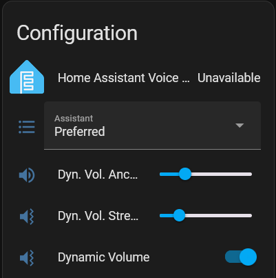
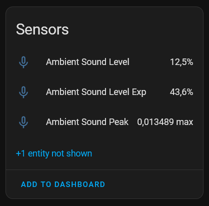
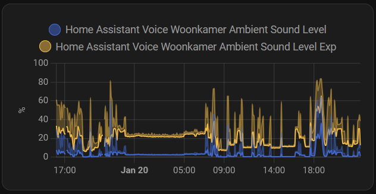

# Home Assistant Voice Dynamic Volume

Smart volume control for your Home Assistant Voice PE device that automatically adjusts based on ambient sound levels. Never be startled by your voice assistant being too loud at night or struggle to hear it in a noisy environment.



## Features

- **Ambient Sound Detection**: Uses the built-in microphones to measure background noise levels
- **Dynamic Volume Adjustment**: Automatically scales volume based on ambient noise
- **Customizable Settings**: 
  - Anchor Volume: Base volume level when it's quiet
  - Strength: How aggressively it scales up in noisy situations
  - Simple toggle to enable/disable
- **Useful Sensors**: Three sensor entities to monitor sound levels
  - Raw peak detection values
  - Linear percentage scaling
  - Exponential scaling to put quieter levels in a more useful range




## Installation

### Method 1: Using ESPHome Packages (Recommended)

1. Add this package to your ESPHome configuration:

```yaml
substitutions:
  name: your-ha-voice-device-name  # Replace with your device name
  friendly_name: Your HA Voice     # Replace with your friendly name

packages:
  # Official ESPHome Home Assistant Voice PE package
  Nabu Casa.Home Assistant Voice PE: github://esphome/home-assistant-voice-pe/home-assistant-voice.yaml
  # Dynamic Volume package
  Jaapp.DynamicVolume: github://jaapp/ha-voice-dynamic-volume/dynamic-volume.yaml

# Your existing API configuration
api:
  encryption:
    key: YOUR_API_KEY

# Your existing WiFi configuration  
wifi:
  ssid: !secret wifi_ssid
  password: !secret wifi_password
```

2. Install the configuration via ESPHome Device Builder

### Method 2: Manual Installation

If you prefer not to use packages, you can copy the full configuration from the [dynamic-volume.yaml](dynamic-volume.yaml) file and add it to your existing ESPHome configuration.

## Usage

After installation, you'll find the new controls in your device's Configuration panel:

1. **Dynamic Volume**: Toggle switch to enable/disable the feature
2. **Dyn. Vol. Anchor**: Base volume level
3. **Dyn. Vol. Strength**: How aggressively volume increases with ambient noise

## Technical Details

The system works by:
1. Sampling the microphone during idle periods
2. Calculating peak amplitude values
3. Scaling these values to a percentage
4. Applying an exponential curve to better represent human perception
5. Adjusting volume based on the calculated ambient noise level

Note: Measurements are paused during media playback to avoid feedback loops.

## Bonus Feature

This configuration also serves as a presence detection proxy - especially useful in homes with children or active areas, as the ambient sound level spikes with activity.

## Contributing

Contributions welcome! Feel free to submit issues or pull requests.

## License

[MIT License](LICENSE)
